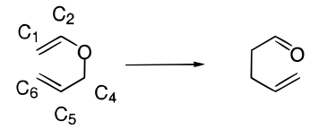
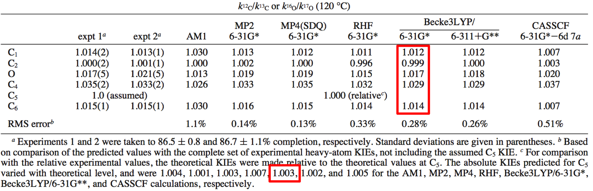

# *PyQuiver*

## Contents
  - [Introduction](#introduction)
    - [Features](#features)
    - [Compatability with Quiver](#compatibility-with-QUIVER)
    - [Installation](#installation)
  
  - [Tutorial](#tutorial)
   - [Summary](#summary)
   - [`autoquiver.py`](#autoquiverpy)

  - [Technical Details](#technical-details)
   - [Interfaces](#interfaces)
   - [.config Files](#config-files)
   - [Input Files](#input-files)
   - [Notes](#notes)

  - [Fine Print](#fine-print)
   - [References](#references)
   - [Authors](#authors)
   - [License](#license)
  
## Introduction

*PyQuiver* is an open-source Python program for calculating kinetic isotope effects (KIEs) and equilibrium isotope effects (EIEs) using harmonic frequencies and the Bigeleisen-Mayer equation.  *PyQuiver* requires Cartesian Hessian matrices, which can be calculated using any electronic structure program. 

### Features

* calculate KIEs or EIEs
* automatically read frequencies from [`g09`](http://www.gaussian.com/g_prod/g09.htm) output files
* excellent performance for larger systems
* highly customizable isotopic substitutions
* arbitrary temperature
* tunnelling corrections: Wigner and Bell infinite parabola
* run via command line or simple Python API

### Compatability with QUIVER

The development of *PyQuiver* was inspired by the [original](#ref2) Fortran program [QUIVER](https://github.com/ekwan/quiver). *PyQuiver* is designed to be as compatible as possible with the original QUIVER program, but to clarify some ambiguity in choice of masses, configuration files need to be updated for use with *PyQuiver*. See the [Configuration](#config-files) section for detail.

### Installation

*PyQuiver* is written in pure Python 2.7.  Its only dependency is `numpy`, a standard Python package for scientific computing that is included in virtually every Python distribution.

1. Install [Python](https://www.continuum.io/downloads) if necesary.
2. Install `numpy` if necessary: [`pip install numpy`](https://pip.pypa.io/en/stable/installing/)
3. Install [git](https://git-scm.com/downloads).  git comes pre-installed on most Linux distributions and Macs.
4. Clone the repository: `git clone https://github.com/ekwan/PyQuiver.git`

For those who do not want to deal with git, click on the green "clone or download" button on this github repository page and click on "Download ZIP" to receive an archive.

Other than downloading the source code, there is nothing to configure, compile, or fiddle with to get *PyQuiver* to run.


## Tutorial

In this tutorial, we reproduce the B3LYP/6-31G* KIE predictions for the following Claisen rearrangement reported by [Singleton](#ref5):





(This is Table 4 in the paper.)

All the files associated with this tutorial are available in the `test/` directory. In particular, the tutorial requires the *PyQuiver* configuration file `claisen_demo.config` and the g09 output files `claisen_gs.out` and `claisen_ts.out`, representing the ground and transition state frequency calculations, respectively.

In general, all KIEs are defined as rate(light)/rate(heavy).  For example, the absolute KIE at C1 is defined as the rate of the rearrangement with carbon-12 at C1 divided by the rate with carbon-13 at C1. This definition is given by this line of the `claisen_demo.config` file:

```
isotopomer C1 1 1 13C
```

`C1` is an arbitrary label for the KIE of interest (it can be any string without a space character).  In general, we may want to calculate multiple KIEs using one configuration file.  For example, the next few lines define the KIEs at C2 and the oxygen:

```
isotopomer C2 2 2 13C
isotopomer O3 3 3 17O
```

In each case, the isotopomer definition is followed by three parameters: the atom number in the ground state, the atom number in the transition state, and the isotope to substitute with.  For example, for C1, atom 1 in the ground state and atom 1 in the transition state will be substituted with carbon-13.  In general, *PyQuiver* will try to prevent you from entering isotopomers that do not make sense.

The definition of `13C` is drawn from `src/weights.dat`:

```
carbon,6,C,12.0,12C,12.0,13C,13.00335,14C,14.0031
```

In English, this says that carbon has an atomic number of 6 and has the symbol `C`.  In all cases (`C1`, `C2`, `O`, etc.), whenever carbon appears in the "light" isotopomer, it is defined to have a mass of `12.0`.  This is called the "default mass."  If the "heavy" replacement is specified as `13C`, it is given a mass of `13.00335`.  Although a number of common replacements are already defined (e.g., `2D` (deuterium) or `18O` (oxygen-18)), it is easy to add more definitions.

Note that KIEs can be defined for multiple isotopic replacements by repeating the label of the isotopomer.  For example, these entries replace two hydrogens with two deuteriums:

```
isotopomer H/D 7 7 2D
isotopomer H/D 8 8 2D
```

Now we are ready to calculate the KIEs!  Enter in the following:

```
cd src/
python quiver.py ../test/claisen_demo.config ../test/claisen_gs.out ../test/claisen_ts.out
```

When run from the command line, *PyQuiver* expects the names (in order) of the configuration file, the ground state file, and the transition state file.  The expected output is:

```
=== PyQuiver Analysis ===
Isotopologue                                              uncorrected      Wigner     infinite parabola
                                                              KIE           KIE              KIE
Isotopologue         C1                                      1.011         1.012            1.013
Isotopologue         C2                                      1.000         1.000            1.000
Isotopologue         C4                                      1.028         1.031            1.031
Isotopologue         C6                                      1.013         1.015            1.015
Isotopologue        H/D                                      0.953         0.954            0.955
Isotopologue         O3                                      1.017         1.018            1.019

KIEs referenced to isotopologue C5. Absolute KIEs are:
Isotopologue         C5                                      1.002         1.002            1.002
```

Note that these KIEs are *relative* to the KIE at `C5`.  This is controlled by this line of the config file:

```
reference_isotopomer C5
```

This means that all absolute KIEs will be divided by this one to give relative KIEs.  Use `none` to calculate absolute KIEs only.

These numbers agree closely with the predictions reported by Singleton.  There are small (0.001-0.002) differences that arise from roundoff errors, differing values of physical constants, and slight changes in the way masses are handled.  These slight differences should not affect any chemical conclusions.

### Summary

The above captures the basic workflow of a *PyQuiver* calculation:

* locate ground and transition states using g09
* run a frequency calculations
* specify the desired isotopic substitutions in a configuration file
* run `python quiver.py` on the configuration, ground state, and transition state files

If EIEs are desired, simply replace the transition state with the equilibrium state of interest.

### `autoquiver.py`

`autoquiver` allows KIEs to be calculated over many ground state and transition state files that share a common set of desired isotopic substitutions.  (The `autoquiver` module has additional functionality when used through a Python interface (read the `src/quiver.ipynb` if interested) but the command line interface should suffice for most purposes.)

Suppose we have a directory, `auto/`, with the following files:

```
substitutions.config
gs-type1.output    ts-type1.output
gs-type2.output    ts-type2.output
gs-type3.output    ts-type3.output
gs-type4.output    ts-type4.output
```

We might want to run *PyQuiver* using the `substitutions.config` file on all pairs of ground states and transition states.  For example, these pairs may be the same calculation run at many levels of theory.  Note that it is crucial that all files have a consistent atom numbering scheme.

To accomplish this we run `autoquiver.py` as follows:

```
python src/autoquiver.py -e .output auto/ auto/substitutions.config gs ts -
```

The arguments are:

* `-e .output`: a flag to look for files with the extension `.output` as the frequency jobs for the ground and transitions states.
* `auto/`: look for files in the `auto/` directory.
* `auto/substitutions.config`: use `auto/substitutions.config` as the configuration file.
* `gs`: use the string "gs" to find ground state files. All files with the appropriate extension that contain the substring "gs" will be treated as ground state files.
* `ts`: use the string "ts" to find transition state files.
* `-`: use the field delimiter "-" to test if a ground state and transition states match. All fields after the first "-" must be identical. This means that `gs-type1.output` and `ts-type1.output` will match but `gs-type1.output` and `ts-type2.output` won't.

The output of autoquiver is directed to a number of csv files corresponding to each configuration file given. These filenames are printed when autoquiver exits.

For more information, the output of `python autoquiver.py -h` has been reproduced below:

```
usage: autoquiver.py [-h] [-v] [-s STYLE] [-e EXT]
                     config target gs_p ts_p delimiter

A program to automatically run PyQuiver on a config file and all ground state
and transition states matching certain constraints.

positional arguments:
  config                configuration file path
  target                target directory file path (where the ground and
                        transition state files live
  gs_p                  substring in ground state files
  ts_p                  substring in transition state files
  delimiter             delimiter used to match ground and transition state
                        files (all fields separated by the delimiter after the
                        first must match)

optional arguments:
  -h, --help            show this help message and exit
  -v, --verbose         when the verbose flag is set debug information is
                        printed
  -s STYLE, --style STYLE
                        style of input files
  -e EXT, --extension EXT
                        extension of input files
```

## Technical Details

   - [Interfaces](#interfaces)
   - [.config Files](#config-files)
   - [Input Files](#input-files)
   - [Defining Masses](#masses)
   - [Notes](#notes)

### Interfaces

*PyQuiver* can be controlled from the command line or its Python API.

To run *PyQuiver* from the command line, issue the following command from the `src/` directory:

```
python quiver.py config_file ground_state_file transition_state_file
```

For more details, run `python quiver.py -h` to display the following help message:

```
usage: quiver.py [-h] [-v] [-s STYLE] config gs ts

A program that calculates KIEs and EIEs based on a ground and transition state
file.

positional arguments:
  config                configuration file path
  gs                    ground state file path
  ts                    transition state file path

optional arguments:
  -h, --help            show this help message and exit
  -v, --verbose         when the verbose flag is set debug information is
                        printed
  -s STYLE, --style STYLE
                        style of input files
```

This command will calculate the KIEs or EIEs associated with the isotopic substitutions specified in the configuration file. For details, see the tutorial above.

*PyQuiver* also has a Python API. The advantage of this interface is that it exposes the underlying Python objects. This allows you to run custom calculations, automate routine calculations, and inspect the internal data directly.

An IPython Notebook is provided as a demonstration.  To try it out, move to the `src/` directory and run the command `ipython notebook`. Then open the `quiver.ipynb` notebook file.

### .config Files

Calculations performed in *PyQuiver* require a configuration file to specify the parameters (such as scaling factor and temperature) and isotopologue substitution rules.

Each configuration file is a plain text file with the following properties:

* blank lines and lines starting with `#` are ignored
* anything after `#` within a line is assumed to be a comment
* fields in directives are separated by spaces.

Valid configuration files have all of the following directives:

* `scaling`: a linear factor by which to scale the frequencies
* `frequency_threshold`: the threshold (in units cm^-1) that defines the cutoff between the small frequencies (corresponding to translation and rotation) and the normal vibrational mode frequencies (typical value: 50; tests show that projecting out rotations and translations have a negligible effect on the predictions.)
* `imag_threshold`: the threshold (in units cm^-1) that defines the cutoff between small and large imaginary frequencies used to distinguish EIE from KIE calculations (typical value: 50)
* `temperature`: the temperature in Kelvin
* `reference_isoto[pomer/logue]`: possible values are `none` or the name of an isotopologue. If `none` is specified, the absolute KIEs will be reported. If the name of an isotopologue is specified, all KIEs will be divided the KIE values for this isotopologue.
* `mass_override_isot[pomer/logue]`: possible values are "default" or the name of an isotopologue. If the value "default" is specified, the masses of the light isotopologue will be the defaults found in `weights.dat`. If the name of an isotopolgoue is given, then that isotopologue is then used to replace the default mass behaviour of PyQuiver at a particular atom. For example, if the isotopomer `C2` replaces carbon 2 with 13C, then specifying `mass_overide_isotopomer C2` will place carbon-13 at C2 *for every KIE calculation*.
* `isoto[pomer/logue]`: the rule used for isotopic substitution. The expected fields are `name ground_state_atom_number transition_state_atom_number substitution`. The final field, `substitution` must correspond to a valid substitution weight. These weights are specified in `weights.dat` (e.g., `13C`, `18O`, `2D`).

### Input Files

*PyQuiver* assumes that the ground state file and transition state file are the outputs of a Gaussian09 `freq` job. To change this assumption *PyQuiver* can accept an additional command-line argument corresponding to the input file style.

Currently, *PyQuiver* can automatically read output files from the following formats:
* Gaussian 2009. Style name: `g09`
* PyQuiver Standard. Style name: `pyquiver`

To specify a format other than `g09` from the command line, run with the `-s` flag. For instance:

```
python quiver.py -s pyquiver ../test/claisen_demo.config ../test/claisen_gs.qin ../test/claisen_ts.qin
```

would execute the example *PyQuiver* job on the Claisen system using the *PyQuiver* standard input files. This allows you to adapt PyQuiver to other electronic structure programs.  (We would be pleased to offer some advice on how to accomplish this.)

The *PyQuiver* Standard is a generic format for the output of an electronic structure program in plain-text outlined as follows:

* The first line of a file should be of the form `NumberOfAtoms` (Ex. `11` would be a valid first line of a file with 11 atoms).
* The next *n* lines, where *n* is the number of atoms, define the geometry. Each line should be of the form:

```
CenterNumber,AtomicNumber,XPosition,YPosition,ZPosition
```

The positions should be provided in units of Angstroms. The center number is the atom index (ranging from 0 and *n-1*, inclusive).
* The next line should contain the lower triangular Cartesian Hessian matrix with no line breaks. In particular, if *H* is the Hessian matrix then *H_(3p+i,3q+j)* corresponds to taking derivatives with respect to atom *p* moving in the *i*th coordinate and atom *q* moving in the `j`th coordinate (*i* and *j* run across the three cartesian coordinates). The entries in the serialized form should be separated by commas. The serialization should occur by stringing together the rows (truncated at the main diagonal). For example, suppose the following is the lower-right triangular form of the Cartesian Hessian for a one atom system:

```
1.0
2.0 3.0
4.0 5.0 6.0
```

then the *PyQuiver* would expect the following line:

```
1.0,2.0,3.0,4.0,5.0,6.0
```

* Example *PyQuiver* standard input files are available in the `test/` directory. The files `claisen_gs.qin` and `claisen_ts.qin` are *PyQuiver* input files corresponding to the example Claisen system discussed in the tutorial.

If input files are provided in a known format other than the *PyQuiver* standard, *PyQuiver* can dump the appropriate *PyQuiver* input files. To do this load the appropriate system (ex. `gs = System("./ground_state.g09")`) and then run `gs.dump_pyquiver_input_file()` which will create the appropriate input file at the same path with the extension `.qin`.

## References

1. **Bigeleisen-Mayer theory:**
  * Bigeleisen, J.; Mayer, M.G. *J. Chem. Phys.*  **1947**, *15*, 261.
  * Wolfsberg, M.  *Acc. Chem. Res.*, **1972**, *5*, 225.
  * <span style="text-decoration:underline">Isotope Effects in the Chemical, Geological, and Bio Sciences</span>  
2. <span id="ref2">**QUIVER:**</span>
  * Saunders, M.; Laidig, K.E. Wolfsberg, M.  *J. Am. Chem. Soc.*, **1988**, *111*, 8989.
3. **Scaling Factors:**
  * Wong.  *Chem. Phys. Lett.* **1996**, *256*, 391-399.
  * Radom.  *J Phys. Chem.* **1996**, *100*, 16502.
4. **Tunnelling Corrections:**
  * Bell.  *Chem. Soc. Rev.*  **1974**, *3*, 513.
5. **Claisen Rearragenent KIEs:**
  * <span id="ref5">Meyer, M.P.; DelMonte, A.J.; Singleton, D.A.</span> *J. Am. Chem. Soc.*, **1999**, *121*, 10865-10874.

## Authors

*PyQuiver* was written by Thayer Anderson and Eugene Kwan at the Department of Chemistry and Chemical Biology at Harvard University.  Please email `ekwan@fas.harvard.edu` with any questions.

## License
   
This project is licensed under the Apache License, Version 2.0. See LICENSE.txt for full terms and conditions.
   
Copyright 2016 Thayer L. Anderson and Eugene E. Kwan
